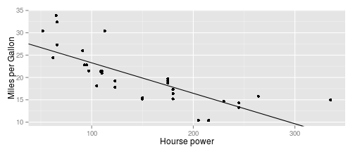

## Overview

- you know, how many horsepower you want in your car
- we can predict, how many miles per gallon such a car will have.
- to do that, we built a mathematical model and trained it on a real dataset

---

## Dataset

 - The data was extracted from the 1974 Motor Trend US magazine
 - see https://goo.gl/ZU7MTU for more details


```r
require(datasets)
head(mtcars)
```

```
##                    mpg cyl disp  hp drat    wt  qsec vs am gear carb
## Mazda RX4         21.0   6  160 110 3.90 2.620 16.46  0  1    4    4
## Mazda RX4 Wag     21.0   6  160 110 3.90 2.875 17.02  0  1    4    4
## Datsun 710        22.8   4  108  93 3.85 2.320 18.61  1  1    4    1
## Hornet 4 Drive    21.4   6  258 110 3.08 3.215 19.44  1  0    3    1
## Hornet Sportabout 18.7   8  360 175 3.15 3.440 17.02  0  0    3    2
## Valiant           18.1   6  225 105 2.76 3.460 20.22  1  0    3    1
```

---

## Model
- a linear model was build
- hourse power was used as a predictor for miles per galon

```r
fit<-lm(formula = mpg~hp, data = mtcars)
fit
```

```
## 
## Call:
## lm(formula = mpg ~ hp, data = mtcars)
## 
## Coefficients:
## (Intercept)           hp  
##    30.09886     -0.06823
```

---

## Visualisation
- The shiny application UI contains visualization of the linear model


```r
require(ggplot2)
qplot(hp, mpg, data = mtcars)+ xlab("Hourse power")+ylab("Miles per Gallon") +
                geom_abline(intercept = coef(fit)[1], slope=coef(fit)[2])
```

 
- checkout yourself: https://kbdata.shinyapps.io/shinyProject/
